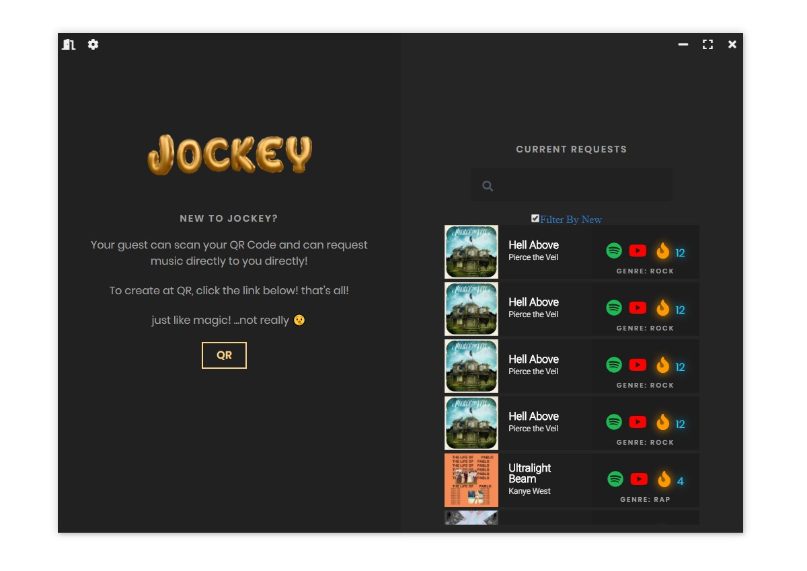

# 𝕵𝖔𝖈𝖐𝖊𝖞 💃🏾👏🏾

seamlessly request music to any event ☁️



## 𝔊𝔢𝔱𝔱𝔦𝔫𝔤 𝔖𝔱𝔞𝔯𝔱𝔢𝔡

These instructions will get you a copy of the project up and running on your local machine for development and testing purposes. See deployment for notes on how to deploy the project on a live system.

### 𝔓𝔯𝔢𝔯𝔢𝔮𝔲𝔦𝔰𝔦𝔱𝔢𝔰

Programs you needs to run Jockey

```
* [yarn](https://yarnpkg.com/en/) - Packager
```

### 𝔈𝔫𝔱𝔢𝔯𝔦𝔫𝔤 𝔭𝔯𝔬𝔧𝔢𝔠𝔱

To enter project pass the following into your terminal

```
$ cd jockey
$ yarn
```
To run the dev environment

```
$ yarn dev
```

# 𝔓𝔞𝔠𝔨𝔞𝔤𝔦𝔫𝔤

```
$ yarn package
```
Multiple Platforms

```
$ yarn package-all
```

## 𝔅𝔲𝔦𝔩𝔱 𝔚𝔦𝔱𝔥

* [React.JS](https://reactjs.org/) - The web framework used
* [Electron](https://electronjs.org/) - Cross-Platform framework


## ℭ𝔯𝔢𝔞𝔱𝔬𝔯𝔰 ヽ༼ຈل͜ຈ༽ﾉ
* **(っ◔◡◔)っ ♥ Shemar Dacosta ♥** - *Project Lead / Frontend Engineer* - [@spookyvert](https://github.com/spookyvert)
* **≋M≋i≋g≋u≋e≋l≋ ≋A≋c≋e≋r≋o≋** - *Frontend Engineer* - [@spookyvert](https://github.com/AceroM)
* **K̾e̾v̾i̾n̾ ̾C̾r̾u̾z̾** - *Frontend Engineer / Designs * - [@spookyvert](https://github.com/KevTLW)
* **𝖈𝖍𝖆𝖗** - *Backend Developer* - [@char](https://github.com/char)

## 𝔏𝔦𝔠𝔢𝔫𝔰𝔢

This project is licensed under the MIT License - see the [LICENSE.md](LICENSE.md) file for details
